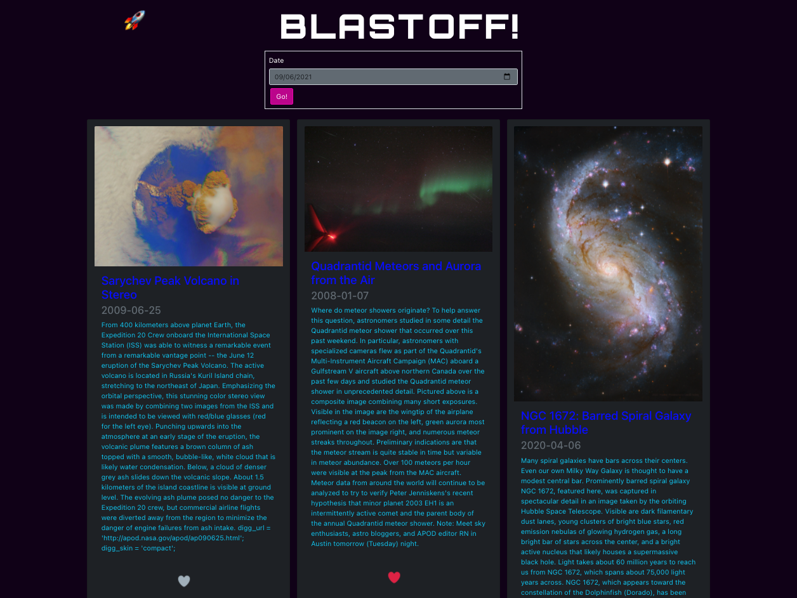

# Blast Off

This is a React application built to make calls to NASA's "Astronomy Picture of the Day" API, automatically generating 10 random images. It also allows users to see what the "Picture of the Day" was for any date between the fruition of the program in 1995 and today. Users may also "like" and "unlike" the randomly generating images. **This application is currently frontend only and these "likes" do not persist in any database.**

## Live
This app is hosted live on heroku here: https://blast-off-apod.herokuapp.com/

## Preview

## Purpose

This single page application was created to satisfy the requirements of Shopify's Front End Developer Intern Challenge for the Winter 2022

## Tech/Frameworks

Built with:
- React(https://reactjs.org/)
- Bootstrap for React(https://react-bootstrap.netlify.app/)

## API Reference:
NASA's "Astronomy Picture of the Day API"(https://github.com/nasa/apod-api)

## Installation:
- Fork and clone repo
- Install all necessary packages by running 'npm install'
- Start the server by running 'npm start'

## Usage:
- Browse images
- "Like" and "Unlike" images by clicking the hearts
- Search for previously featured images or videos through the date form

 
